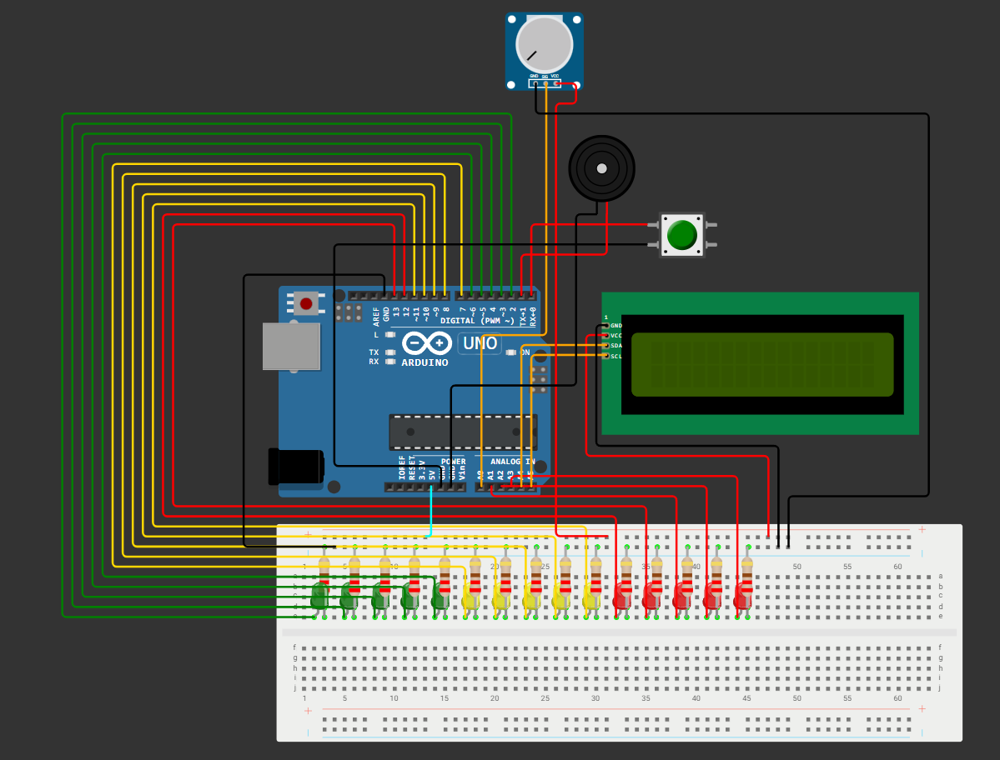
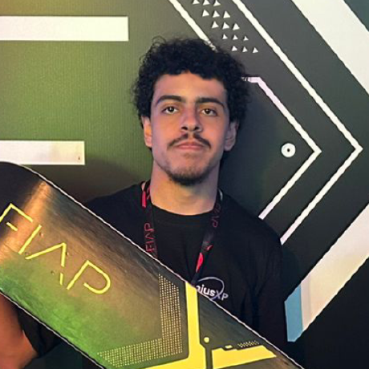

<h1 align="center">QKD Satellite Security Prototype</h1>

<p align="center">
  Protótipo Arduino de comunicação segura inspirado em QKD (Quantum Key Distribution), utilizando LCD I2C, LEDs, buzzer e monitoramento de QBER.
</p>

<p align="center">
  
  
  
</p>

---

# 📖 Sobre o Projeto

Este projeto simula uma comunicação segura inspirada nos conceitos de **Distribuição Quântica de Chaves (QKD)** utilizados em arquiteturas de segurança para bancos, governos e infraestruturas críticas.

O protótipo foi desenvolvido em Arduino e representa visualmente as etapas de:

- Emissão de fótons;
- Medição dos estados quânticos;
- Cálculo da taxa de erro (QBER);
- Detecção de possível interceptação;
- Aceitação ou descarte da chave.

O sistema utiliza LEDs, buzzer, display LCD e potenciômetro para criar uma experiência interativa que demonstra os princípios básicos da troca segura de chaves.

---

# 🖼️ Protótipo Final

<p align="center">
  
</p>

---

# 🎯 Objetivo

Demonstrar de forma visual e interativa o processo de verificação da integridade de uma chave criptográfica utilizando conceitos inspirados em comunicação quântica.

---

# ⚙️ Funcionalidades

- Início da sessão por botão físico;
- Simulação da emissão de fótons;
- Simulação da medição dos estados;
- Monitoramento de QBER através de potenciômetro;
- Detecção de interceptação;
- Feedback visual por LEDs;
- Feedback sonoro por buzzer;
- Exibição de status em LCD 16x2 I2C;
- Estatísticas de sessões executadas;
- Cálculo da taxa de sucesso.

---

# 🔧 Componentes Utilizados

| Componente | Quantidade |
|------------|------------|
| Arduino UNO | 1 |
| LCD 16x2 I2C | 1 |
| Potenciômetro | 1 |
| Push Button | 1 |
| Buzzer | 1 |
| LEDs Verdes | 5 |
| LEDs Amarelos | 5 |
| LEDs Vermelhos | 5 |
| Resistores | 15 |
| Protoboard | 1 |

---

# 🔌 Mapeamento dos Pinos

## Entradas

| Componente | Pino |
|------------|------|
| Potenciômetro | A0 |
| Botão | D0 |

## Saídas

| Componente | Pino |
|------------|------|
| Buzzer | D1 |

### LEDs Verdes

| LED | Pino |
|------|------|
| 1 | D2 |
| 2 | D3 |
| 3 | D4 |
| 4 | D5 |
| 5 | D6 |

### LEDs Amarelos

| LED | Pino |
|------|------|
| 1 | D7 |
| 2 | D8 |
| 3 | D9 |
| 4 | D10 |
| 5 | D11 |

### LEDs Vermelhos

| LED | Pino |
|------|------|
| 1 | D12 |
| 2 | D13 |
| 3 | A1 |
| 4 | A2 |
| 5 | A3 |

### LCD I2C

| LCD | Arduino |
|------|----------|
| SDA | A4 |
| SCL | A5 |

---

# 🚀 Fluxo de Execução

## 1. Inicialização

Ao ligar o sistema:

- LCD exibe a tela inicial;
- LEDs executam animação de boot;
- Sistema entra em modo de espera.

## 2. Emissão

Os LEDs verdes representam a transmissão dos fótons.

## 3. Medição

Os LEDs amarelos simulam a medição dos estados quânticos.

## 4. Verificação

O potenciômetro gera um valor de QBER entre:

```text
0% a 25%
```

O sistema compara esse valor com o limite definido:

```cpp
const int QBER_LIMITE = 11;
```

### Resultado

| Condição | Resultado |
|-----------|------------|
| QBER < 11% | Chave Aceita |
| QBER ≥ 11% | Chave Rejeitada |

---

# 📊 Indicadores

Ao final de cada sessão o LCD exibe:

- Número da sessão;
- Resultado da sessão;
- Taxa de sucesso acumulada.

Exemplo:

```text
Sessao 5 OK
Taxa OK: 80%
```

---

# 📚 Bibliotecas Utilizadas

```cpp
#include <Wire.h>
#include <LiquidCrystal_I2C.h>
```

Biblioteca necessária:

```text
LiquidCrystal_I2C
```

---

# ▶️ Como Executar

1. Abrir o projeto na Arduino IDE;
2. Instalar a biblioteca LiquidCrystal_I2C;
3. Realizar as conexões conforme o esquema elétrico;
4. Enviar o código para a placa;
5. Pressionar o botão para iniciar uma sessão;
6. Ajustar o potenciômetro para alterar o QBER.

---

# 👨‍💻 Autores

<table>
  <tr>
    <td align="center">
      <br>
      <b>Állex Brandão</b>
    </td>
    <td align="center">
      <br>
      <b>Erick Nathan</b>
    </td>
    <td align="center">
      <br>
      <b>Enzo Abreu</b>
    </td>
    <td align="center">
      <br>
      <b>Henrique Bueno</b>
    </td>
    <td align="center">
      <br>
      <b>Murilo Gomes</b>
    </td>
  </tr>
</table>

---